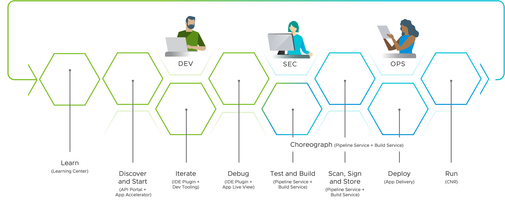

**VMware Tanzu Application Platform** (TAP) is a modular, **application-aware platform** that runs on any compliant public cloud or on-premises Kubernetes cluster. It delivers a superior **developer experience** with a prepaved path to production, including all the needed components preconfigured for developer teams to build and deploy software quickly and securely. 

